# シーケンス図

このドキュメントでは、AWS LambdaとAPI Gatewayを使用したリモートMCPサーバーの各種フローのシーケンス図を示します。

## 目次

1. [DCR (Dynamic Client Registration) フロー](#dcr-dynamic-client-registration-フロー)
2. [OAuth 2.1 Authorization Code Grant フロー](#oauth-21-authorization-code-grant-フロー)
3. [OAuth 2.1 Client Credentials Grant フロー](#oauth-21-client-credentials-grant-フロー)
4. [MCPプロトコル通信フロー](#mcpプロトコル通信フロー)
5. [Refresh Token Grant フロー](#refresh-token-grant-フロー)

---

## DCR (Dynamic Client Registration) フロー

RFC 7591に基づくクライアント登録フローです。

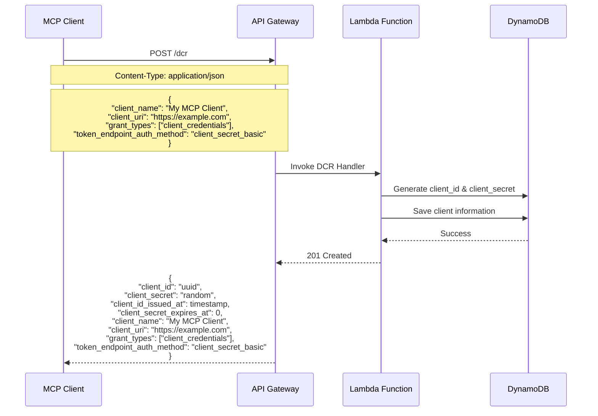

---

## OAuth 2.1 Authorization Code Grant フロー

PKCEを使用したOAuth 2.1準拠のAuthorization Code Grantフローです。

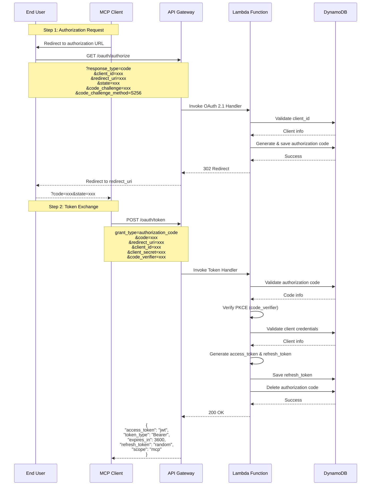

---

## OAuth 2.1 Client Credentials Grant フロー

MCPサーバーで主に使用されるClient Credentials Grantフローです。

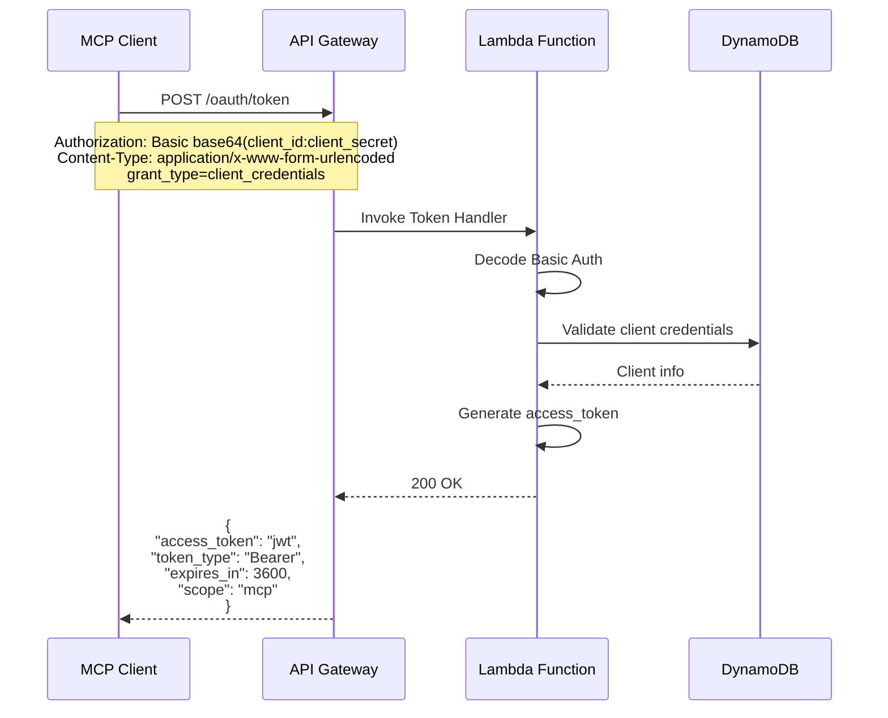

---

## MCPプロトコル通信フロー

JWTトークンを使用したMCPプロトコル通信フローです。

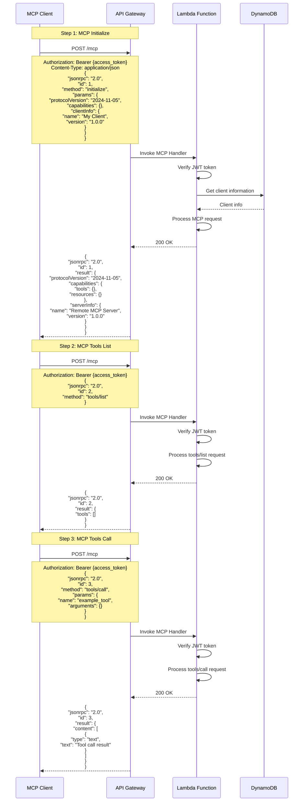

---

## Refresh Token Grant フロー

Access Tokenの更新フローです。

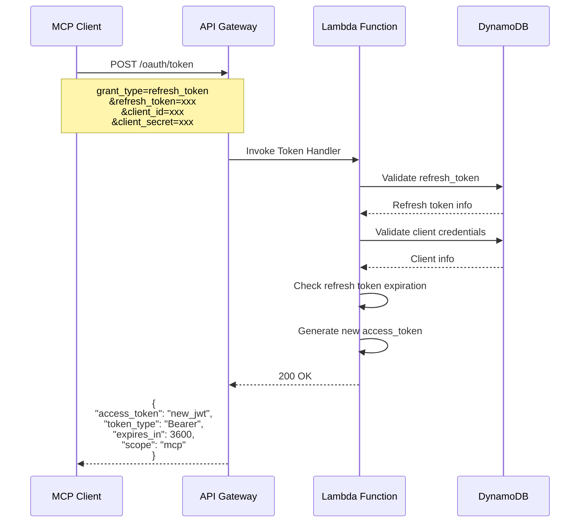

---

## エラーハンドリングフロー

認証エラーやバリデーションエラーの処理フローです。

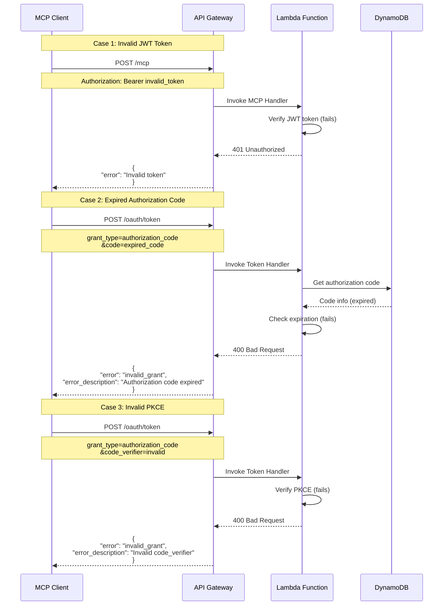

---

## セキュリティフロー

セキュリティ関連の処理フローです。

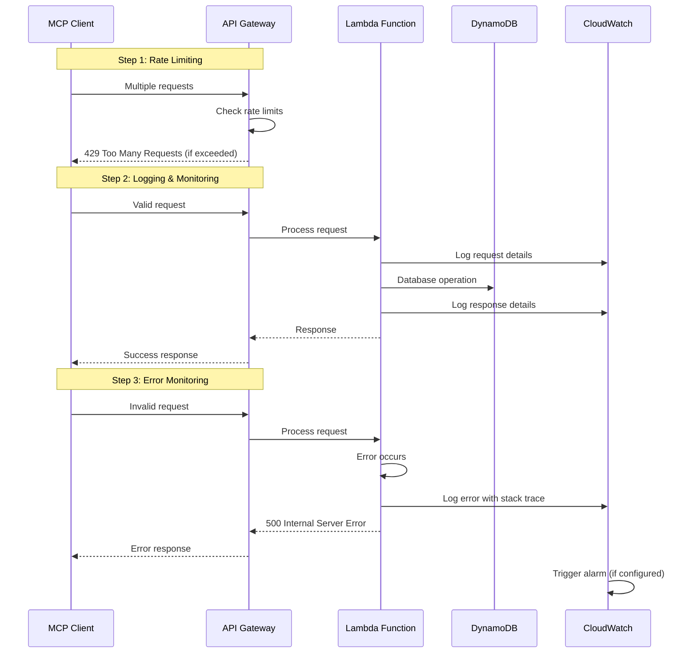

---

## 完全な統合フロー

DCRからMCP通信までの完全な統合フローです。

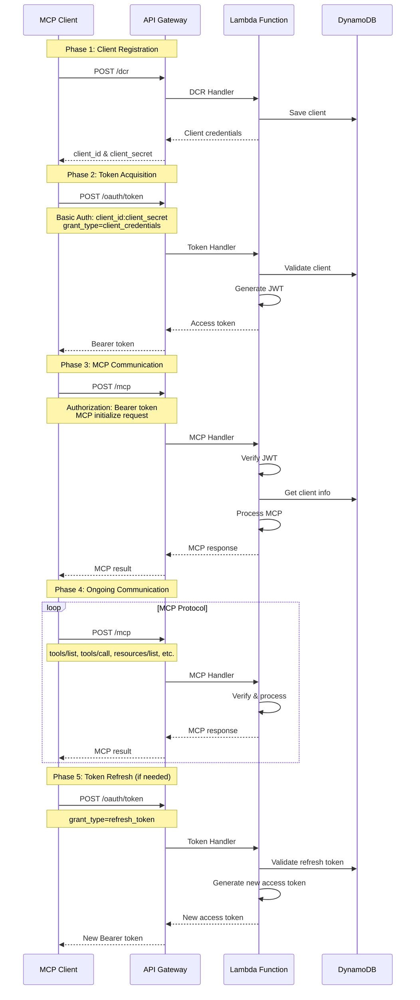

---

## 技術仕様

### エンドポイント一覧

| エンドポイント | メソッド | 説明 | OAuth 2.1準拠 |
|---------------|---------|------|---------------|
| `/dcr` | POST | Dynamic Client Registration | ✅ |
| `/oauth/authorize` | GET | Authorization Endpoint | ✅ |
| `/oauth/token` | POST | Token Endpoint | ✅ |
| `/oauth/userinfo` | GET | UserInfo Endpoint | ✅ |
| `/mcp` | POST | MCP Protocol Endpoint | ✅ |
| `/clients/{clientId}` | GET | Client Information | ✅ |
| `/clients/{clientId}` | DELETE | Client Deletion | ✅ |

### サポートするGrant Types

| Grant Type | 説明 | 実装状況 |
|------------|------|----------|
| `authorization_code` | Authorization Code Grant with PKCE | ✅ |
| `client_credentials` | Client Credentials Grant | ✅ |
| `refresh_token` | Refresh Token Grant | ✅ |

### セキュリティ機能

| 機能 | 説明 | 実装状況 |
|------|------|----------|
| PKCE | Proof Key for Code Exchange | ✅ |
| State Parameter | CSRF攻撃対策 | ✅ |
| JWT Tokens | セキュアなトークン | ✅ |
| HTTPS | 必須通信暗号化 | ✅ |
| Rate Limiting | レート制限 | 🔄 |
| CORS | クロスオリジン制御 | ✅ |

### データベーステーブル

| テーブル名 | 用途 | 主キー |
|-----------|------|--------|
| `mcp-clients` | クライアント情報 | `clientId` |
| `mcp-auth-codes` | Authorization Code | `code` |
| `mcp-refresh-tokens` | Refresh Token | `refreshToken` |

---

## トラブルシューティング

### よくある問題と解決方法

#### 1. 認証エラー (401 Unauthorized)
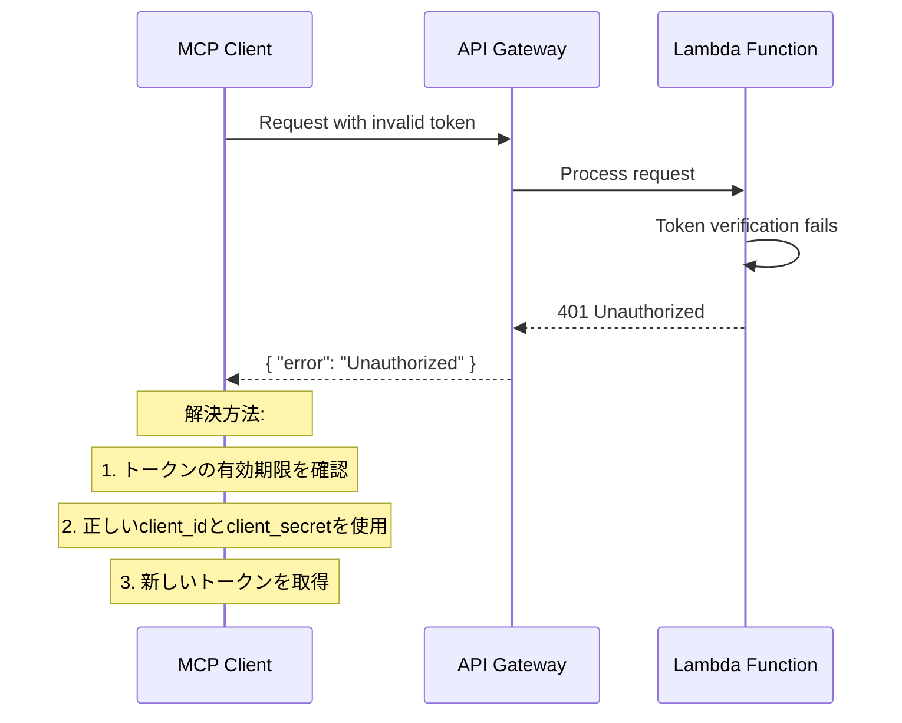

#### 2. PKCE検証エラー (400 Bad Request)
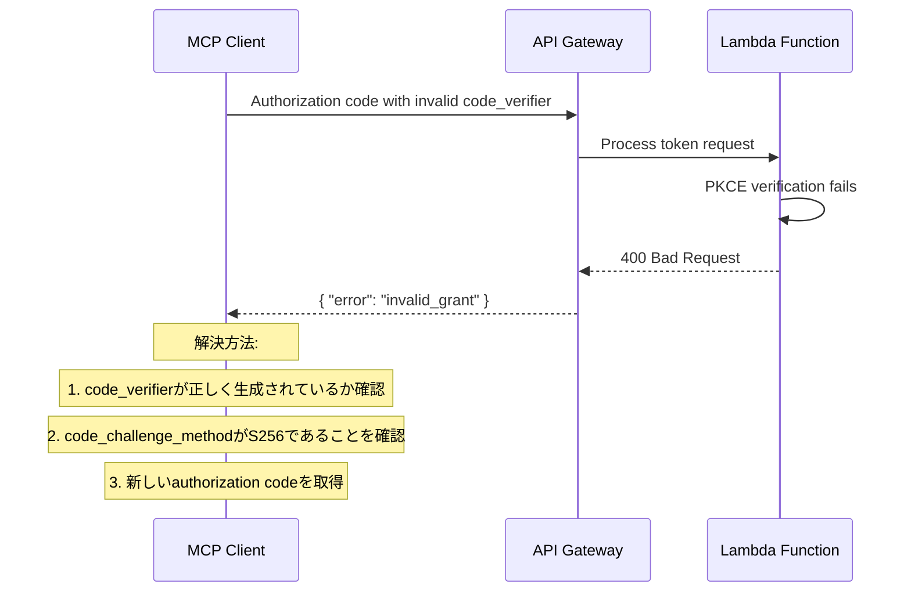

#### 3. データベースエラー (500 Internal Server Error)
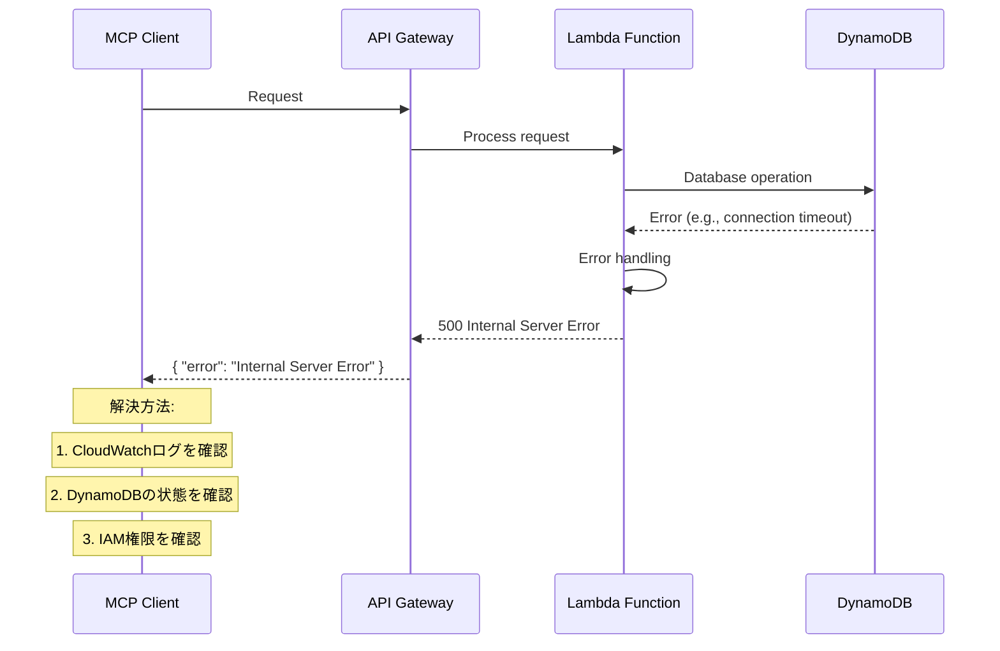

---

## 監視とログ

### CloudWatchメトリクス

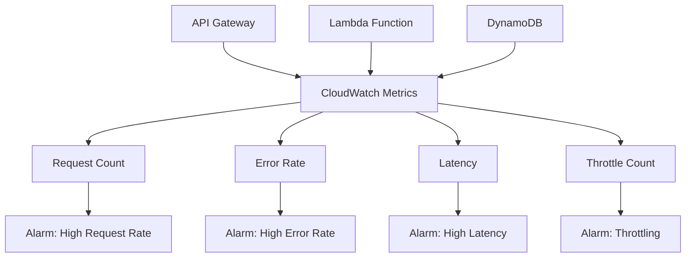

### ログ構造

#### API Gateway アクセスログ
```
{
  "timestamp": "2024-01-01T00:00:00Z",
  "requestId": "request-id",
  "ip": "192.168.1.1",
  "userAgent": "MCP-Client/1.0",
  "requestTime": 100,
  "status": 200,
  "method": "POST",
  "path": "/mcp",
  "protocol": "HTTPS/1.1"
}
```

#### Lambda 実行ログ
```
{
  "timestamp": "2024-01-01T00:00:00Z",
  "level": "INFO",
  "requestId": "request-id",
  "functionName": "mcp-handler",
  "message": "Processing MCP request",
  "clientId": "client-id",
  "method": "initialize"
}
```

#### エラーログ
```
{
  "timestamp": "2024-01-01T00:00:00Z",
  "level": "ERROR",
  "requestId": "request-id",
  "functionName": "mcp-handler",
  "error": "Invalid JWT token",
  "stackTrace": "...",
  "clientId": "client-id"
}
```

---

## パフォーマンス考慮事項

### レイテンシー最適化

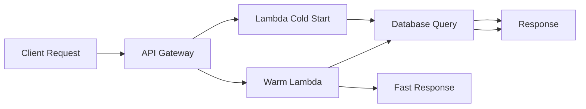

### スケーラビリティ

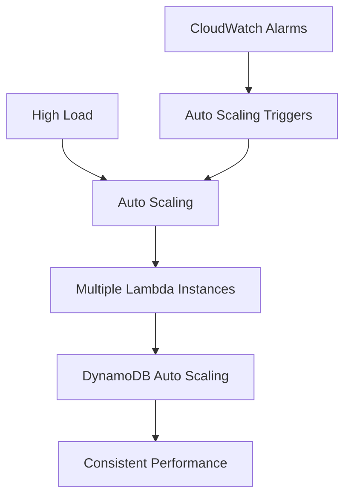

---

このドキュメントは、AWS LambdaとAPI Gatewayを使用したリモートMCPサーバーの完全なシーケンス図と技術仕様を提供します。各フローはOAuth 2.1準拠で実装されており、セキュリティとパフォーマンスを考慮した設計となっています。 